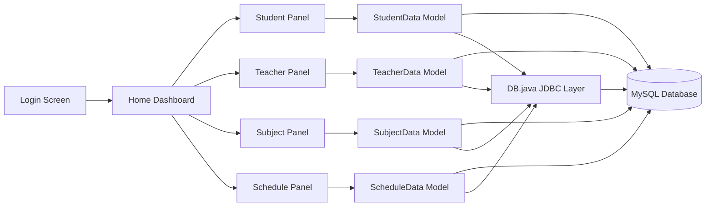
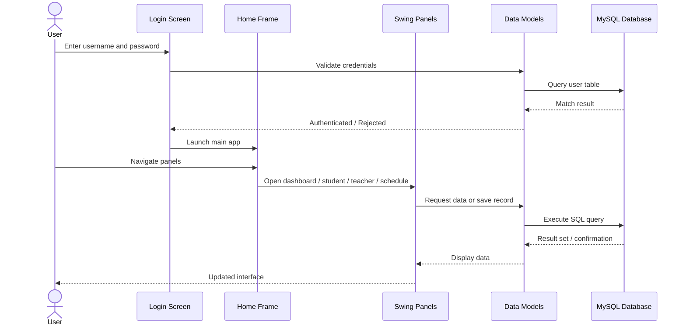
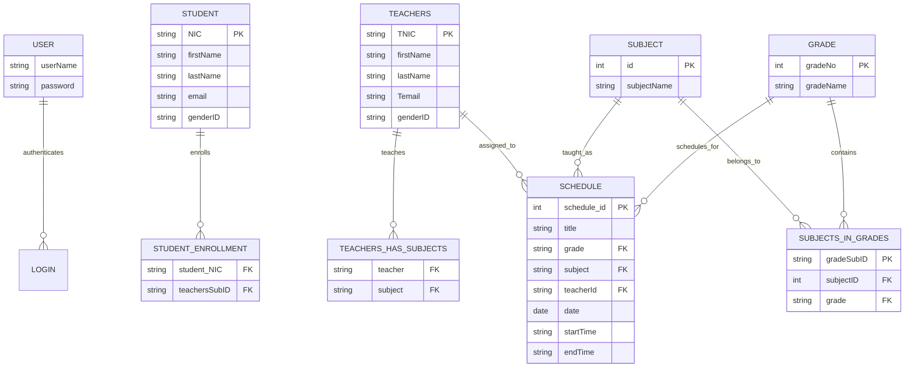
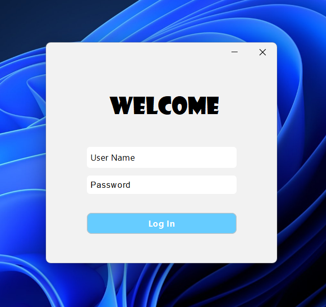
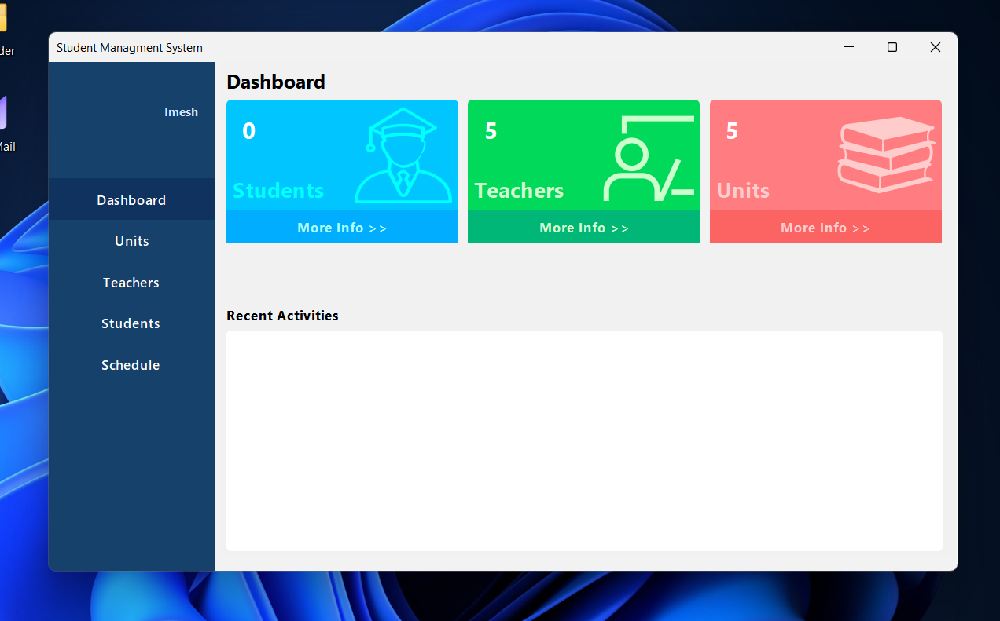
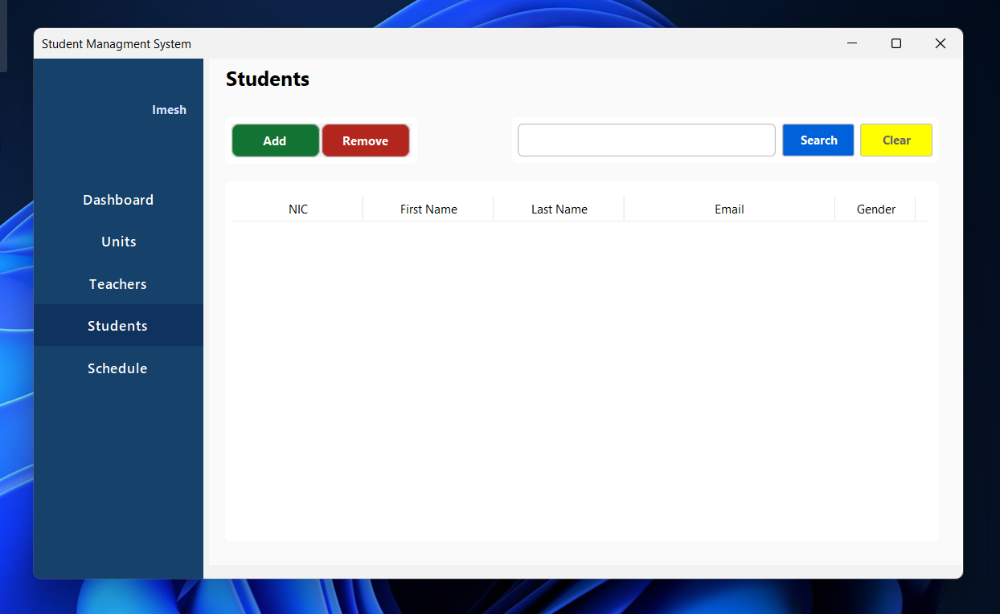
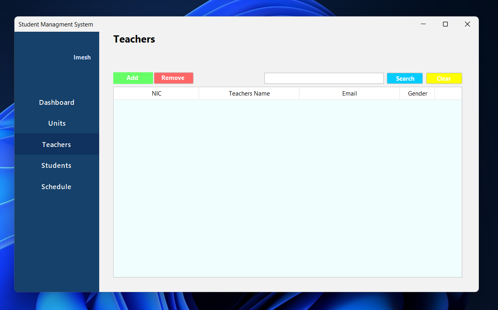
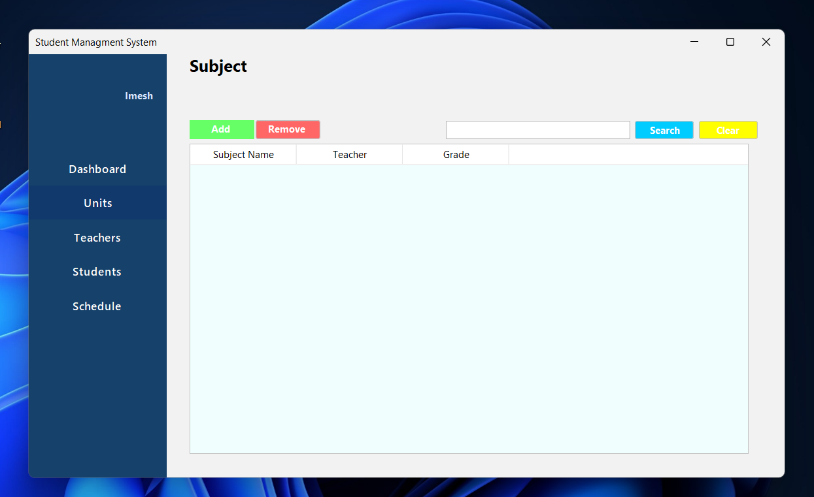
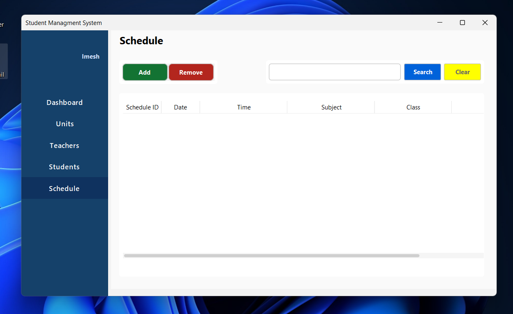

# Student Management System

Tags: `Java` `Swing` `MySQL` `JDBC` `CRUD` `Desktop App` `NetBeans` `Academic Project`

## Project Overview

This project is a desktop-based Student Management System developed for an academic Software Architecture and Design assignment. It provides a simple but complete educational administration interface for managing students, teachers, subjects, and class schedules in a school environment.

The application is built with Java Swing and connects to a MySQL database using JDBC. It focuses on practical CRUD operations, dashboard reporting, and role-based navigation within a single desktop application shell.

## System Architecture

The application follows a layered architecture that separates the user interface, business/data access logic, and persistence layer:



- Presentation Layer: Swing Forms and Panels
  - GUI views are located in `src/gui` and `src/panel`
  - These classes handle user interaction, layout, form validation, and navigation between screens
- Application/Logic Layer: Model classes
  - Data operations are encapsulated in `src/model`
  - Each model class performs insert, update, delete, and read operations related to a domain such as students, teachers, subjects, or schedules
- Data Access Layer: JDBC helper
  - `src/connection/DB.java` manages database connections and SQL execution
- Persistence Layer: MySQL database
  - All management data is stored in MySQL tables with relational links between entities

In practical terms, the UI sends database queries through model classes, which use the `DB` class to interact with MySQL. This keeps the GUI code cleaner and supports reuse of the data access logic.

## Application Features

- User login authentication using the `user` table
- Dashboard summary cards for total students, teachers, and subjects
- Student registration, search, listing, and deletion
- Teacher registration, search, listing, and deletion
- Subject and grade-related management
- Schedule creation and viewing for teachers, subjects, and grades
- Side navigation using a `CardLayout`-based home interface
- MySQL-backed persistence for all records

## Project Structure

```text
StudentManagementSystem/
├── build/                     # Compiled build artifacts and generated classes
├── lib/                      # Third-party JAR libraries
│   ├── CopyLibs/
│   ├── nblibraries.properties
│   └── ...
├── nbproject/                # NetBeans project metadata and build configuration
├── src/
│   ├── connection/
│   │   └── DB.java            # JDBC connection manager
│   ├── dto/
│   │   ├── Schedule.java
│   │   ├── Student.java
│   │   ├── Subject.java
│   │   └── Teacher.java
│   ├── gui/
│   │   ├── Home.java
│   │   ├── Login.java
│   │   ├── NewShedule.java
│   │   ├── StudentRegister.java
│   │   ├── SubjectRegister.java
│   │   ├── TeacherDetails.java
│   │   └── TeacherRegister.java
│   ├── model/
│   │   ├── ComboItem.java
│   │   ├── GradeData.java
│   │   ├── ScheduleData.java
│   │   ├── StudentData.java
│   │   ├── Subject.java
│   │   ├── SubjectData.java
│   │   ├── Teacher.java
│   │   └── TeacherData.java
│   ├── panel/
│   │   ├── Dashboard.java
│   │   ├── SchedulePanel.java
│   │   ├── Students.java
│   │   ├── SubjectPanel.java
│   │   └── Teachers.java
│   └── icon/
├── test/
├── build.xml                 # Ant build file
├── manifest.mf               # JAR manifest
├── README.md
└── ...
```

## Tech Stack

| Component | Technology |
| --- | --- |
| Programming Language | Java |
| GUI Framework | Java Swing |
| UI Styling | FlatLaf |
| Database | MySQL |
| Database Connector | JDBC / MySQL Connector/J |
| Build Tool | Apache Ant |
| IDE | Apache NetBeans |
| Date Component | JCalendar |

## Workflow



1. Launch the application.
2. The login screen authenticates the user against the `user` table in MySQL.
3. After successful login, the home screen loads with a navigation sidebar.
4. The user can open the dashboard to view summary counts.
5. Student, teacher, subject, and schedule panels allow record creation, search, and listing.
6. All CRUD requests are executed through the model layer and persisted in the database.
7. Data is retrieved and displayed back in the Swing panels for continuous user interaction.

## Database Entity Relationship

The relational schema is centered on schools and academic records. The current implementation uses tables such as `student`, `teachers`, `subject`, `grade`, `student_enrollment`, `subjects_in_grades`, `teachers_has_subjects`, and `schedule`.



### Entity Notes

- `student` stores student personal records and contact information.
- `teachers` stores teacher personal information and subject assignments.
- `subject` stores available academic subjects.
- `grade` stores grade levels and labels.
- `subjects_in_grades` links subjects to grades.
- `teachers_has_subjects` links teachers to subjects they teach.
- `student_enrollment` links students to the teacher-subject combinations in which they are enrolled.
- `schedule` stores timetable records for classes.

## Screenshots

Below are the key user interface screens from the project, stored in the `docs/images` folder.

### Login and Dashboard





### Student Management




### Teacher Management




### Subject and Schedule Management






## How to Setup the Project

### 1. Prerequisites

- Java JDK 8 or higher (project is designed for Java desktop development)
- Apache NetBeans IDE or a Java build tool such as Ant
- MySQL Server running locally
- JDBC MySQL driver available in the project libraries

### 2. Clone the Project

```bash
git clone https://github.com/your-username/StudentManagementSystem.git
cd StudentManagementSystem
```

### 3. Configure MySQL Database

Create a database named `students_db` in MySQL.

Example:

```sql
CREATE DATABASE students_db;
```

Then create the required tables. A basic set of entities should include:

```sql
CREATE TABLE `user` (
    `userName` VARCHAR(100) NOT NULL,
    `password` VARCHAR(255) NOT NULL
);

CREATE TABLE `student` (
    `NIC` VARCHAR(20) PRIMARY KEY,
    `firstName` VARCHAR(100),
    `lastName` VARCHAR(100),
    `email` VARCHAR(150),
    `genderID` VARCHAR(20)
);

CREATE TABLE `teachers` (
    `TNIC` VARCHAR(20) PRIMARY KEY,
    `firstName` VARCHAR(100),
    `lastName` VARCHAR(100),
    `Temail` VARCHAR(150),
    `genderID` VARCHAR(20)
);

CREATE TABLE `subject` (
    `id` INT AUTO_INCREMENT PRIMARY KEY,
    `subjectName` VARCHAR(150)
);

CREATE TABLE `grade` (
    `gradeNo` INT PRIMARY KEY,
    `gradeName` VARCHAR(50)
);
```

### 4. Update Database Credentials

Open `src/connection/DB.java` and update the connection values if necessary:

```java
private static final String URL = "jdbc:mysql://127.0.0.1:3306/students_db";
private static final String USER = "root";
private static final String PASSWORD = "your_mysql_password";
```

### 5. Insert an Admin User

Add a record to the `user` table so the login form can authenticate successfully:

```sql
INSERT INTO `user` (`userName`, `password`)
VALUES ('admin', 'admin123');
```

### 6. Run the Project

#### Option A: NetBeans

1. Open the project in NetBeans.
2. Click Run > Build and Run Project.
3. The login screen will appear.

#### Option B: Ant command line

```bash
ant clean
ant jar
java -jar dist/StudentManagmentSystem.jar
```

### 7. Common Notes

- If the database connection fails, confirm the MySQL server is running and the credentials match your local configuration.
- If the project does not build, verify the library JAR files are present in the `lib` folder.
- If the application starts but no data appears, confirm the MySQL schema includes the tables and columns expected by the Java model classes.

## License

This project was developed as an academic assignment and is intended for educational use.
